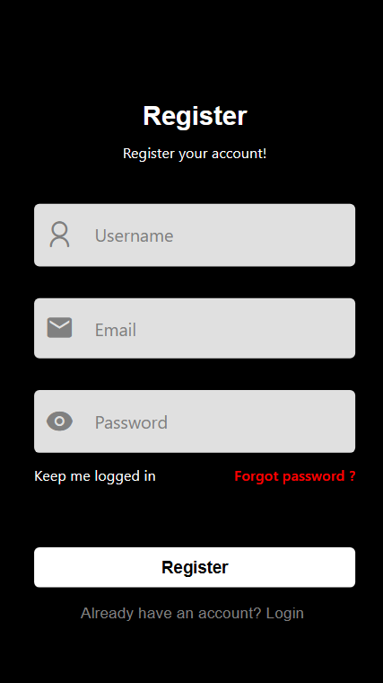

# React-Native

Hello, this is a React-Native Full Stack Project.

## 1. TODO List

### Home Page
   

       
   

   
### Calendar Page
   

       
   

### Profile Page
   

       
   

### Login Page
   

       
   

### Register Page
   

       
   

